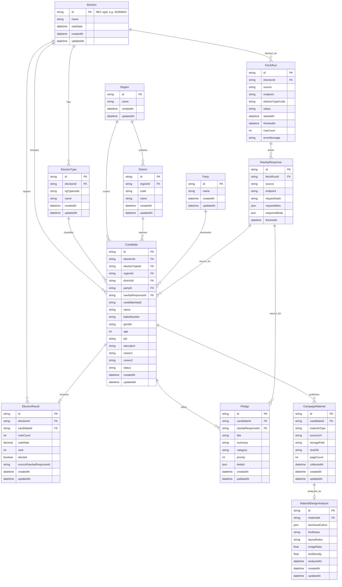

# Election Data ERD

Updated: 2026-06-01

This ERD covers the first storage foundation for official NEC API data plus later campaign-material/design-analysis work.

## Build Phases

1. Storage foundation: Docker PostgreSQL, Prisma, migration, DB connection test.
2. API provenance: `FetchRun` and `RawApiResponse` first, then normalized official-code records.
3. Candidate and pledge ingestion: store official candidate rows and pledge rows with raw response references.
4. Campaign material collection: store PDF/image URL, local storage path, hash, page count, and collection status.
5. Design analysis: store colors, font notes, layout notes, image ratio, and text density as derived data.
6. Election result analysis: connect result rows back to candidates to compare pledges/material design against outcomes.

## Important Design Choices

- Raw API responses are first-class records, not temporary logs.
- Nullable region/district/party fields are allowed because early API payloads may not map cleanly.
- `ElectionType` uses official `sgTypecode`; this keeps market/governor/education-superintendent filtering aligned with NEC.
- Candidate API IDs are nullable until we confirm the stable key from the candidate endpoint response.
- Candidate `career1` and `career2` preserve the official candidate API career fields for detail-page inspection.
